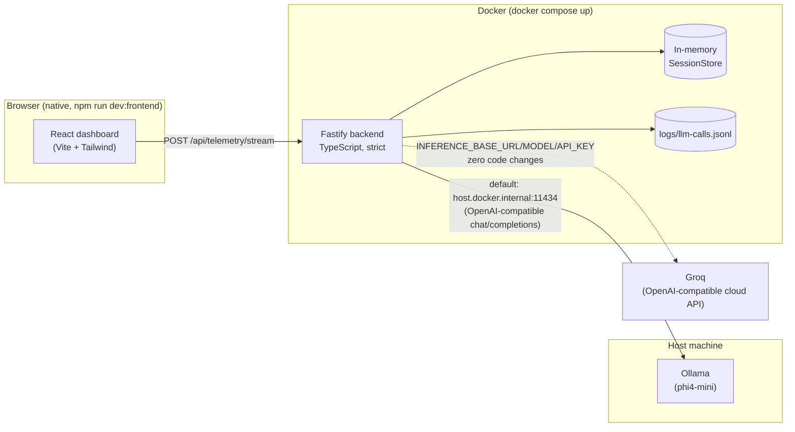

# Architecture

Technical decisions behind the Sentiment Intelligence Engine, for Echory's Senior Full-Stack
Engineer technical assessment (Track A). Full supporting detail — benchmark numbers, dated
decision logs, ticket-by-ticket history — lives in [`docs/`](docs/); this document is the
synthesized version for review and interview defense.

> **Status note:** one piece of this architecture is provisional. Ollama currently runs
> host-native rather than in a container (see [Known limitations](#known-limitations) and
> [ticket 0017](docs/tickets/blocked/0017-containerize-ollama.md)) — resolving that is blocked on
> confirming with Pascal whether GPU passthrough into Docker is viable on Echory's evaluation
> machine. Everything else here is settled.

## System overview

**Why this shape:** the backend is the only piece that must be reachable at a fixed contract
(`POST /api/telemetry/stream` on `localhost:3000`) for automated evaluation, so it's the one
component fully containerized and locked down (ticket 0012, 0016). The frontend is a native dev
server — not scoring-relevant per the challenge brief, so containerizing it wasn't worth the time
(ticket 0009's log). The LLM sits behind one interface (`SentimentProvider`) regardless of where it
actually runs, which is the mechanism the next section explains.

## LLM provider choice, and why

**Chosen: `phi4-mini` (3.8B), served locally via Ollama, called through an OpenAI-compatible HTTP
endpoint.** Full benchmark methodology and numbers: [`docs/benchmark-results.md`](docs/benchmark-results.md).

**Hardware these numbers were produced on** (per Pascal's explicit request that latency figures be
hardware-qualified): NVIDIA GeForce RTX 5080, 16GB VRAM (Windows Task Manager/WMI under-report this
card's VRAM — confirmed via `nvidia-smi`, not assumed), Windows 11 Pro. All `phi4-mini` and
`granite4.1:3b` latency numbers below and in `docs/benchmark-results.md` are GPU-accelerated on this
card; an evaluator without comparable GPU access would see local inference run slower (see
[Known limitations](#known-limitations)).

The decision in one table (28 combined test cases — an 18-case hand-labeled set plus a 10-case
independent holdout, used specifically to catch prompt-overfitting):

| Model | Sentiment acc. | Risk acc. | Avg latency | % of calls > 500ms |
|---|---|---|---|---|
| **`phi4-mini` (chosen)** | 82% | 75% | 408ms | **0%** |
| `groq/qwen3.8-27b` | 93% | 71% | 378ms | 14% |

`qwen3.8-27b` beats `phi4-mini` on accuracy *and* average latency — a genuinely close call, not an
easy win for the local model. It was declined anyway because its 14% chance of exceeding 500ms
comes from Groq-side queue/network variance that no amount of prompt or code tuning fixes (measured
directly, not assumed — see `docs/benchmark-results.md`'s prompt-shortening diagnostic), and the
challenge scores latency as a pass/fail cliff, not a smooth penalty: *"consistently exceeding 500ms
counts as a failure."* Risking the 25%-weighted latency dimension for a partial gain in the
30%-weighted accuracy dimension — where `phi4-mini` already scores respectably — wasn't worth it.
Both the accuracy and latency numbers above were re-verified end-to-end against the real, running
server in ticket 0008 (real HTTP requests, not just raw model calls): p50 332ms, p95 366ms, max
374ms, 0/28 over 500ms in steady state.

**What was ruled out, and why (full detail in `docs/benchmark-results.md`):**
- Every "thinking"-capable local model (the Qwen3.x family, `gpt-oss`) — reasoning capability is
  baked into the model's architecture, not a runtime-suppressible behavior. Even with chain-of-
  thought output suppressed, these models carry a structural latency penalty that misses the budget
  regardless of prompting (ticket 0005's hardware probe: `qwen3:8b` averaged 1040ms, `qwen3.5:9b`
  1472ms, vs. `llama3.2:1b`'s 174ms).
- `gemma4:e2b` — looked like the best local candidate at 89% accuracy on the original 18-case set,
  but dropped to 70% on the independent holdout — roughly 19 points of test-set overfitting, not
  genuine quality. This is why the holdout set exists at all, and why it's mentioned here: the
  headline number for the chosen model is holdout-validated, not just fit to the set used to design
  the prompt.
- `groq/gpt-oss-20b` — a near-coin-flip latency failure (46% of calls over 500ms, p50 already at the
  line), an easy rule-out despite reasonable accuracy.

**Swap-ins, both already wired and documented in `backend/.env.example`, zero code changes for
either:**
- `granite4.1:3b` (local) — the safer accuracy/latency tradeoff if `phi4-mini`'s numbers ever need
  revisiting (70% accuracy, wider latency margin).
- `groq/qwen3.8-27b` (cloud) — per Pascal's explicit request that the inference endpoint stay
  swappable to an external provider if the local/containerized setup has problems on Echory's side.
  This is a hard requirement, not a nice-to-have — see [ticket 0007](docs/tickets/finished/0007-inference-provider.md).

### How the swap actually works

One `InferenceProvider` class, one default code path: a real HTTP call to
`${INFERENCE_BASE_URL}/chat/completions` using the OpenAI `response_format: {type: "json_schema",
...}` mechanism — confirmed necessary even for non-reasoning models (`phi4-mini` wraps JSON in
markdown fences without it, `granite4.1:3b` silently drops `risk_level`). Pointing this at Ollama
locally or at Groq's cloud API is a three-line `.env` change (`INFERENCE_BASE_URL`,
`INFERENCE_MODEL`, `INFERENCE_API_KEY`), never a code change. A narrow, documented opt-in
(`INFERENCE_DISABLE_THINKING`) routes to Ollama's native `/api/chat` with `think: false` instead,
for the case where a future local model choice turns out to need reasoning suppressed (Ollama's
OpenAI-compatible endpoint can't do this at all — verified directly in ticket 0005). It isn't
exercised by the current model choice, but was verified working against a real reasoning model
(`qwen3:8b`) rather than left as an untested code path.

## Streaming and concurrency

The API contract is per-chunk request/response, not a persistent stream — each
`POST /api/telemetry/stream` call is independent and stateless from the HTTP layer's perspective.
A WebSocket endpoint is explicitly optional per the challenge brief ("not evaluated automatically")
and wasn't built; the frontend instead drives a scripted multi-chunk call through the real HTTP
endpoint with realistic pacing between chunks, which demonstrates the same live-updating behavior
for the required dashboard without adding an unevaluated code path this deadline didn't have room
to also harden and test.

**Concurrency correctness** — multiple sessions must never bleed state into each other — comes from
two things working together:
1. `SessionStore` keys every chunk by `session_id` in a `Map<string, StoredChunk[]>`. The
   `append()` call itself is fully synchronous (no `await` inside it), so JavaScript's single-
   threaded event loop makes a mid-append race structurally impossible — there is no window where
   two concurrent requests could interleave *inside* that call.
2. The only genuine concurrency risk is a route-handler bug that reads the wrong request's data
   while multiple `provider.analyze()` calls are in flight simultaneously (real interleaved awaits,
   not merely "many sessions used one after another"). Ticket 0008 tests exactly this: 20 requests
   fired concurrently across 4 sessions via `Promise.all` against a fake provider with a randomized
   delay (to force genuine interleaving) that echoes the exact `chunk_id` it received back — a
   tripwire that would catch any accidental cross-request data mixup directly. Result: every
   response matched its own request, and each session's stored history contained exactly its own
   chunks. (This same test, and its randomized-delay design, caught and led to fixing a real
   analogous bug in the frontend's session-trigger button — see
   [ticket 0009's log](docs/tickets/finished/0009-required-ui-components.md) — so it's not a
   theoretical concern; the same class of bug showed up twice.)

## Detecting sarcasm and hidden intent

This is the highest-weighted scored dimension (30%), so it drove both the prompt design and the
model selection process, not just the prompt:

- **The core rule**: when the words and the acoustic signals disagree, the acoustic signal wins.
  The system prompt states this explicitly and gives a worked example (calm-sounding words at high
  `pitch_volatility`/`speech_rate_wpm`/`volume_intensity` → sarcastic or suppressed frustration, not
  a literal positive reading) — this is the single most common failure mode across every model
  tested (see `docs/benchmark-results.md`'s round-by-round history).
- **Explicit tie-breaking rules for the boundary cases that actually confused models** during
  benchmarking, not hypothesized in advance: a calm, hostility-free rejection is `negative`, not
  `aggressive`, even though it's still a refusal; a sudden shock/distress reaction (interrupted
  sentences, "wait — what?") is a genuine emotional reaction, not `deflecting` — deflection is a
  deliberate stalling *strategy*. Both rules were added after `granite4.1:3b`'s Round 3 benchmark
  run surfaced them as its specific, repeatable failure modes, then validated to generalize (not
  just memorize) via three new worked examples not drawn from the benchmark set itself.
- **Structured output enforcement** (`response_format` / Ollama's `format` field) is a correctness
  requirement here, not a nicety — an unconstrained small model drops required fields or wraps JSON
  in markdown under this prompt's length/complexity, which would silently corrupt exactly the
  nuanced fields (`hidden_intent`, `volatility_flag`) this dimension is scored on.
- **Overfitting was checked, not assumed away.** An independent 10-case holdout set (deliberately
  different phrasing/contexts than the 18 cases used to design the prompt) is run against every
  serious candidate before a decision, specifically because the first "best" candidate
  (`gemma4:e2b`) turned out to be ~19 points of test-set fitting rather than genuine quality. See
  `docs/benchmark-results.md` for that finding and the methodology it produced.

## Known limitations

- **Ollama is not yet containerized** (see the status note at the top) — it runs natively on the
  host, reached via `host.docker.internal`. This is the one open architectural question in this
  document; see [ticket 0017](docs/tickets/blocked/0017-containerize-ollama.md) for the two options
  and why the decision is deliberately not made unilaterally (GPU passthrough into a container
  isn't guaranteed — no path at all on Docker Desktop for Mac, needs the NVIDIA Container Toolkit
  configured on Windows/Linux — and silently falling back to CPU-only inference risks the scored
  latency dimension).
- **Vite dev-server vulnerabilities accepted, not fixed**: `npm audit` flags a moderate esbuild
  dev-server CORS advisory and a high-severity Vite `server.fs.deny` bypass on Windows — both
  dev-server-only, not present in a production build, and not reachable outside `localhost`. The
  full fix (Vite 8) needs Node `^20.19.0`/`>=22.12.0` (this project's dev environment is on 21.4.0,
  outside that range) plus a Rolldown-based `@vitejs/plugin-react` peer dependency — not a drop-in
  bump. Judged disproportionate effort for a non-production-facing risk under this deadline
  (ticket 0002's log); tracked as a candidate item in [ticket 0011](docs/tickets/open/0011-nice-to-haves.md).
- **In-memory session store**: `SessionStore` is a `Map` living in the backend process's memory —
  correct and fully isolated per session (see [Concurrency](#streaming-and-concurrency) above), but
  not persisted across a restart and not shareable across multiple backend instances. Fine for this
  assessment's single-instance scope; a production version would move this to Redis or a database.
- **No auth or rate limiting** on the API — appropriate for a technical assessment reachable only on
  `localhost`, not appropriate as-is for a real deployment.

`GET /api/telemetry/session/:session_id/summary` (the Track B requirement) is implemented — not a
limitation, but worth noting it went in late (ticket 0010) once time allowed: `dominant_sentiment`
is the modal sentiment across the session, `aggregated_volatility_score` is the share of chunks
flagged volatile (a deliberately simpler definition than a risk-weighted mean — a product judgement,
documented as such in `SessionStore.summarize()`), and `top_risk_moments` is the top 3 by severity,
ties broken by recency. Returns `404` for an unknown session rather than an empty 200.

## What would come next with more time

1. Resolve ticket 0017 with Pascal and containerize Ollama if GPU passthrough is confirmed workable
   — the last piece needed for a genuinely single-command, fully self-contained `docker compose up`.
2. A persistent session store (Redis) if this ever needed to run as more than one backend instance.
3. The Vite 8 upgrade, once a Node version bump is acceptable.
4. A scripted WebSocket streaming demo, purely for a livelier Loom walkthrough — cosmetic, not
   scoring-relevant, so it stayed last in line (ticket 0011).
