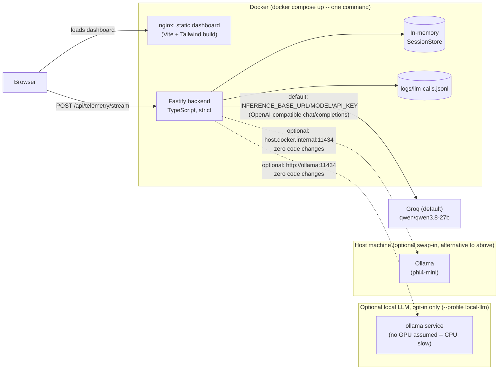

# Architecture

Technical decisions behind the Sentiment Intelligence Engine, for Echory's Senior Full-Stack
Engineer technical assessment (Track A). Full supporting detail — benchmark numbers, dated
decision logs, ticket-by-ticket history — lives in [`docs/`](docs/); this document is the
synthesized version for review and interview defense.

## System overview

**Why this shape:** the backend must be reachable at a fixed contract (`POST /api/telemetry/stream`
on `localhost:3000`) for automated evaluation, and Echory wants the whole app up from one command
(ticket 0019) — so both backend and frontend are containerized, `docker compose up` starts both, and
neither has a supported native path (tickets 0012, 0016, 0019). The frontend builds to static
assets and is served by nginx, not a dev server. The LLM sits behind one interface
(`SentimentProvider`) regardless of where it actually runs — Groq by default, needing neither a GPU
nor anything installed on the host, per
Pascal's explicit answer (ticket 0018) that Echory's evaluation environment shouldn't be assumed to
have either.

## LLM provider choice, and why

**Shipped default: `groq/qwen3.8-27b`, cloud, via Groq's OpenAI-compatible endpoint.** This is a
direct instruction from Pascal (Echory CTO), not our own first choice — see
[ticket 0018](docs/tickets/finished/0018-groq-default-per-pascal.md) for the full email. His
reasoning: don't assume GPU passthrough into a container, and don't assume any install step on
Echory's side. A cloud endpoint is the only option that satisfies both unconditionally.

**The tradeoff, measured, not glossed over** (28 combined test cases — an 18-case hand-labeled set
plus a 10-case independent holdout, used specifically to catch prompt-overfitting; full methodology
in [`docs/benchmark-results.md`](docs/benchmark-results.md)):

| Model | Sentiment acc. | Risk acc. | Avg latency | % of calls > 500ms |
|---|---|---|---|---|
| **`groq/qwen3.8-27b` (shipped default)** | 93% | 71% | 378ms | **14%** |
| `phi4-mini` (local swap-in) | 82% | 75% | 408ms | 0% |

`qwen3.8-27b` beats `phi4-mini` on accuracy *and* average latency — but it carries a measured ~14%
chance of any individual call exceeding the 500ms line, from Groq-side queue/network variance that
no amount of prompt or code tuning fixes (directly tested, not assumed: a shorter prompt doesn't
help, since prefill time was never the bottleneck — see `docs/benchmark-results.md`'s
prompt-shortening diagnostic). Before Pascal's answer, we had provisionally gone the other way —
keeping the local model as default specifically to avoid that tail risk, since the challenge scores
latency as a pass/fail cliff, not a smooth penalty (*"consistently exceeding 500ms counts as a
failure"*). Pascal's answer settles which provider is the *default* on infrastructure grounds
(no GPU/install assumption), independent of that latency argument — and he confirmed directly that
documenting the measurement and the decision, rather than resolving the tradeoff away, is itself
part of what's being assessed here. So: this is a known, accepted risk on the shipped default, not
an oversight. Both the accuracy and latency numbers above were re-verified end-to-end against the
real, running server (not just raw model calls) — ticket 0008 measured `phi4-mini`'s p50 332ms /
p95 366ms / 0/28 over 500ms in steady state; the equivalent full end-to-end run was not repeated for
`groq/qwen3.8-27b` specifically, so the 378ms/14% figures above are ticket 0015's raw-model-call
measurements, not a ticket-0008-style server-level re-verification.

**Hardware the local-swap-in numbers were produced on** (per Pascal's explicit request that latency
figures be hardware-qualified): NVIDIA GeForce RTX 5080, 16GB VRAM (Windows Task Manager/WMI
under-report this card's VRAM — confirmed via `nvidia-smi`, not assumed), Windows 11 Pro. The Groq
numbers are cloud-side and hardware-independent on our end; they do depend on network conditions
between the calling machine and Groq's servers, measured from Felix's own network — an evaluator's
network has no guarantee of being comparable (`docs/benchmark-results.md` says this too).

**What was ruled out, and why (full detail in `docs/benchmark-results.md`):**
- Every "thinking"-capable local model (the Qwen3.x family, `gpt-oss`) — reasoning capability is
  baked into the model's architecture, not a runtime-suppressible behavior. Even with chain-of-
  thought output suppressed, these models carry a structural latency penalty that misses the budget
  regardless of prompting (ticket 0005's hardware probe: `qwen3:8b` averaged 1040ms, `qwen3.5:9b`
  1472ms, vs. `llama3.2:1b`'s 174ms).
- `gemma4:e2b` — looked like the best local candidate at 89% accuracy on the original 18-case set,
  but dropped to 70% on the independent holdout — roughly 19 points of test-set overfitting, not
  genuine quality. This is why the holdout set exists at all, and why it's mentioned here: every
  accuracy number quoted anywhere in this document is holdout-validated, not just fit to the set
  used to design the prompt.
- `groq/gpt-oss-20b` — a near-coin-flip latency failure (46% of calls over 500ms, p50 already at the
  line), an easy rule-out despite reasonable accuracy.

**Swap-ins, both already wired and documented in `backend/.env.example`, zero code changes for
either:**
- `phi4-mini` (local, via Ollama) — the zero-latency-variance alternative, for anyone who'd rather
  accept the tradeoffs below than Groq's tail-latency risk. Two ways to run it, both documented in
  `backend/.env.example` (ticket 0019): a host-native Ollama install (`ollama pull phi4-mini`), or
  the optional containerized `ollama` service (`docker compose --profile local-llm up`) — opt-in
  only, never started by a plain `docker compose up`, and deliberately requests no GPU (Pascal's
  explicit ask): measured at 6.3s warm through that path (see Known Limitations below), vs. ~400ms
  GPU-accelerated on the host-native path.
- `granite4.1:3b` (local) — a safer accuracy/latency tradeoff than `phi4-mini` if those numbers ever
  need revisiting (70% accuracy, wider latency margin). Swap via `INFERENCE_MODEL` alone.

### How the swap actually works

One `InferenceProvider` class, one default code path: a real HTTP call to
`${INFERENCE_BASE_URL}/chat/completions` using the OpenAI `response_format: {type: "json_schema",
...}` mechanism — confirmed necessary even for non-reasoning models (`phi4-mini` wraps JSON in
markdown fences without it, `granite4.1:3b` silently drops `risk_level`). Pointing this at Ollama
locally or at Groq's cloud API is a three-line `.env` change (`INFERENCE_BASE_URL`,
`INFERENCE_MODEL`, `INFERENCE_API_KEY`), never a code change. A narrow, documented opt-in
(`INFERENCE_DISABLE_THINKING`) routes to Ollama's native `/api/chat` with `think: false` instead,
for the case where a future local model choice turns out to need reasoning suppressed (Ollama's
OpenAI-compatible endpoint can't do this at all — verified directly in ticket 0005). It isn't
exercised by the current model choice, but was verified working against a real reasoning model
(`qwen3:8b`) rather than left as an untested code path.

## Streaming and concurrency

The API contract is per-chunk request/response, not a persistent stream — each
`POST /api/telemetry/stream` call is independent and stateless from the HTTP layer's perspective.
A WebSocket endpoint is explicitly optional per the challenge brief ("not evaluated automatically")
and wasn't built; the frontend instead drives a scripted multi-chunk call through the real HTTP
endpoint with realistic pacing between chunks, which demonstrates the same live-updating behavior
for the required dashboard without adding an unevaluated code path this deadline didn't have room
to also harden and test.

**Concurrency correctness** — multiple sessions must never bleed state into each other — comes from
two things working together:
1. `SessionStore` keys every chunk by `session_id` in a `Map<string, StoredChunk[]>`. The
   `append()` call itself is fully synchronous (no `await` inside it), so JavaScript's single-
   threaded event loop makes a mid-append race structurally impossible — there is no window where
   two concurrent requests could interleave *inside* that call.
2. The only genuine concurrency risk is a route-handler bug that reads the wrong request's data
   while multiple `provider.analyze()` calls are in flight simultaneously (real interleaved awaits,
   not merely "many sessions used one after another"). Ticket 0008 tests exactly this: 20 requests
   fired concurrently across 4 sessions via `Promise.all` against a fake provider with a randomized
   delay (to force genuine interleaving) that echoes the exact `chunk_id` it received back — a
   tripwire that would catch any accidental cross-request data mixup directly. Result: every
   response matched its own request, and each session's stored history contained exactly its own
   chunks. (This same test, and its randomized-delay design, caught and led to fixing a real
   analogous bug in the frontend's session-trigger button — see
   [ticket 0009's log](docs/tickets/finished/0009-required-ui-components.md) — so it's not a
   theoretical concern; the same class of bug showed up twice.)

## Observability

Every real LLM call (i.e. not the rule-based placeholder) logs `chunk_id`, `session_id`,
provider/model, latency, prompt, raw response, parsed result, and token counts to
`backend/logs/llm-calls.jsonl` — this is what tickets 0006/0015's model benchmarks read to compute
per-model latency stats, not a write-only log nobody looks at.

**Optional**: the same call is also recorded as a Langfuse generation, off by default and enabled
only when `LANGFUSE_PUBLIC_KEY`/`LANGFUSE_SECRET_KEY` are both set — with no keys, the OpenTelemetry
pipeline is never started and this is fully inert (verified directly: a request against a container
with no Langfuse keys behaves identically to one with the observability code deleted). Never awaited
before the response is sent, and never allowed to surface as a failure to the caller — observability
must not add latency or become a new way for the API to break. Implemented against Langfuse's current
OpenTelemetry-based SDK (`@langfuse/tracing`/`@langfuse/otel`, not the older `Langfuse` client class),
and verified by fetching the actual recorded trace back via the Langfuse API/CLI and checking it
against Langfuse's own "what does a good trace look like" guidance — not just assumed to work because
the code compiled. That check caught two real gaps before they shipped: the observation's own
recorded latency was 0 (spans were being created after the call had already finished, so start/end
had to be explicitly backdated to the real call's timing) and the input was cluttered with the full
system prompt repeated identically on every trace (moved to metadata, leaving `input` as just the
transcript being classified).

## Detecting sarcasm and hidden intent

This is the highest-weighted scored dimension (30%), so it drove both the prompt design and the
model selection process, not just the prompt:

- **The core rule**: when the words and the acoustic signals disagree, the acoustic signal wins.
  The system prompt states this explicitly and gives a worked example (calm-sounding words at high
  `pitch_volatility`/`speech_rate_wpm`/`volume_intensity` → sarcastic or suppressed frustration, not
  a literal positive reading) — this is the single most common failure mode across every model
  tested (see `docs/benchmark-results.md`'s round-by-round history).
- **Explicit tie-breaking rules for the boundary cases that actually confused models** during
  benchmarking, not hypothesized in advance: a calm, hostility-free rejection is `negative`, not
  `aggressive`, even though it's still a refusal; a sudden shock/distress reaction (interrupted
  sentences, "wait — what?") is a genuine emotional reaction, not `deflecting` — deflection is a
  deliberate stalling *strategy*. Both rules were added after `granite4.1:3b`'s Round 3 benchmark
  run surfaced them as its specific, repeatable failure modes, then validated to generalize (not
  just memorize) via three new worked examples not drawn from the benchmark set itself.
- **Structured output enforcement** (`response_format` / Ollama's `format` field) is a correctness
  requirement here, not a nicety — an unconstrained small model drops required fields or wraps JSON
  in markdown under this prompt's length/complexity, which would silently corrupt exactly the
  nuanced fields (`hidden_intent`, `volatility_flag`) this dimension is scored on.
- **Overfitting was checked, not assumed away.** An independent 10-case holdout set (deliberately
  different phrasing/contexts than the 18 cases used to design the prompt) is run against every
  serious candidate before a decision, specifically because the first "best" candidate
  (`gemma4:e2b`) turned out to be ~19 points of test-set fitting rather than genuine quality. See
  `docs/benchmark-results.md` for that finding and the methodology it produced.

- **Groq's tail latency is a known, accepted risk on the shipped default**, not a limitation that
  slipped through — see [LLM provider choice](#llm-provider-choice-and-why) above for the full
  measurement and why it's shipped anyway per Pascal's explicit instruction.
- **The optional local-LLM container (`docker compose --profile local-llm up`) has no GPU
  acceleration, deliberately** — Pascal's explicit ask not to assume it. Measured directly (ticket
  0019), not estimated: `phi4-mini` through this container, warm, took **6.3s** — over 15x its
  GPU-accelerated warm latency (~330-400ms, tickets 0006/0008) for the identical model and prompt,
  comfortably past the 500ms line. A real, stated tradeoff of opting into this path, not a bug: the
  default (Groq) exists specifically so nothing depends on this being fast, or even present
  (ticket 0019). A host-native Ollama install remains the zero-latency-risk
  local option for anyone with GPU acceleration already configured there.
- **Vite dev-server vulnerabilities accepted, not fixed**: `npm audit` flags a moderate esbuild
  dev-server CORS advisory and a high-severity Vite `server.fs.deny` bypass on Windows — both
  dev-server-only, not present in a production build, and not reachable outside `localhost`. The
  full fix (Vite 8) needs Node `^20.19.0`/`>=22.12.0` (this project's dev environment is on 21.4.0,
  outside that range) plus a Rolldown-based `@vitejs/plugin-react` peer dependency — not a drop-in
  bump. Judged disproportionate effort for a non-production-facing risk under this deadline
  (ticket 0002's log); tracked as a candidate item in [ticket 0011](docs/tickets/open/0011-nice-to-haves.md).
- **In-memory session store**: `SessionStore` is a `Map` living in the backend process's memory —
  correct and fully isolated per session (see [Concurrency](#streaming-and-concurrency) above), but
  not persisted across a restart and not shareable across multiple backend instances. Fine for this
  assessment's single-instance scope; a production version would move this to Redis or a database.
- **No auth or rate limiting** on the API — appropriate for a technical assessment reachable only on
  `localhost`, not appropriate as-is for a real deployment.

`GET /api/telemetry/session/:session_id/summary` (the Track B requirement) is implemented — not a
limitation, but worth noting it went in late (ticket 0010) once time allowed: `dominant_sentiment`
is the modal sentiment across the session, `aggregated_volatility_score` is the share of chunks
flagged volatile (a deliberately simpler definition than a risk-weighted mean — a product judgement,
documented as such in `SessionStore.summarize()`), and `top_risk_moments` is the top 3 by severity,
ties broken by recency. Returns `404` for an unknown session rather than an empty 200.

## Considered and rejected: racing two concurrent Groq requests

An idea for reducing exposure to the ~14% tail-latency risk: fire two requests to Groq for every
chunk simultaneously and use whichever returns first, discarding the slower one. Considered,
**not implemented**. The reasoning against it: this doubles outbound request volume against Groq's
per-key rate limits for every chunk processed, and Echory's automated evaluation harness's actual
request volume/rate isn't known in advance. Ticket 0015's benchmarking already hit a token-per-
minute rate limit once under far lighter load than a real evaluation run would produce, and ticket
0019 separately found (while dockerizing the frontend) that this account also has a stricter
output-tokens-per-minute limit than expected. Deliberately doubling request volume against an
unknown ceiling risks turning an occasional slow response into a burst of hard failures instead —
a worse outcome than the tail latency it would be trying to avoid. Documented here rather than
silently dropped or built without being asked to.

## What would come next with more time

1. A persistent session store (Redis) if this ever needed to run as more than one backend instance.
2. The Vite 8 upgrade, once a Node version bump is acceptable.
3. A scripted WebSocket streaming demo, purely for a livelier Loom walkthrough — cosmetic, not
   scoring-relevant, so it stayed last in line (ticket 0011).
